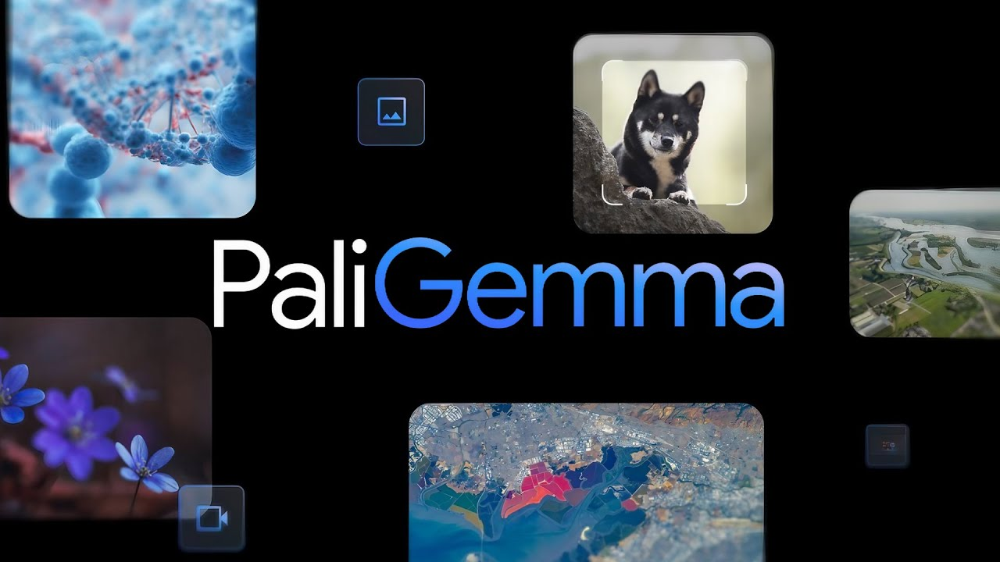

# PaliGemma: A Versatile Vision-Language Model

## Overview

PaliGemma is an open-source Vision-Language Model (VLM) designed to address a broad range of vision-language tasks. It combines the **SigLIP-So400m** vision encoder and the **Gemma-2B** language model, offering state-of-the-art performance across diverse tasks, including image classification, captioning, question answering, and segmentation. This model is particularly focused on being a versatile, compact base model for transfer to specialized applications, avoiding the need for massive parameter sizes while maintaining competitive results with larger models.

This implementation of PaliGemma closely follows the methodology outlined in the research paper "PaliGemma: A versatile 3B VLM for transfer." Below is a detailed overview of the architecture, training, and notable results from the paper.

---

## Key Features and Contributions

1. **Architecture**:
   - Combines the **SigLIP-So400m** vision encoder, a contrastively pre-trained vision transformer, and the **Gemma-2B** auto-regressive language model.
   - Implements a linear projection layer to bridge outputs of the vision encoder with the language model.
   - Follows a prefix-LM approach, enabling the model to perform tasks such as captioning, question answering, and segmentation.

2. **Performance**:
   - PaliGemma achieves results comparable to much larger models (e.g., PaLI-X with 55B parameters) across benchmarks.
   - Demonstrates versatility in specialized tasks such as **remote-sensing VQA**, **video captioning**, and **referring expression segmentation**.

3. **Scalability**:
   - Trained with multiple resolution configurations (224px, 448px, and 896px) to support different tasks and precision requirements.
   - Optimized for transfer learning, allowing fine-tuning on downstream tasks with minimal computational resources.

4. **Training Paradigm**:
   - PaliGemma follows a multi-stage training process:
     - **Stage 0**: Unimodal pretraining using off-the-shelf components.
     - **Stage 1**: Joint multimodal pretraining across a variety of vision-language tasks.
     - **Stage 2**: High-resolution pretraining to support tasks requiring finer details.
     - **Stage 3**: Task-specific fine-tuning for academic and real-world benchmarks.

---

## Core Architecture

### 1. Vision Encoder
The **SigLIP-So400m** encoder is responsible for converting images into a sequence of tokens. It is pre-trained using contrastive learning and optimized for compactness without sacrificing performance.

### 2. Language Model
The **Gemma-2B** auto-regressive model provides the text-generation capabilities of PaliGemma. It excels in generating detailed and contextually relevant textual descriptions for a variety of input prompts.

### 3. Integration and Attention Mechanism
PaliGemma employs a linear projection layer to align the vision encoder's outputs with the input space of the language model. It uses a **prefix-LM masking strategy**, allowing image tokens and text prompts to interact freely while maintaining autoregressive attention on the output.

---

## Training Process

### Stage 0: Unimodal Pretraining
- The SigLIP encoder and Gemma language model are independently pre-trained using publicly available datasets.

### Stage 1: Multimodal Pretraining
- A diverse mixture of tasks (e.g., captioning, visual question answering) is used to train the entire model jointly.
- Unlike many VLMs, the image encoder is not frozen, allowing it to adapt and learn additional spatial and relational features.

### Stage 2: Resolution Scaling
- High-resolution inputs (448px and 896px) are introduced to improve performance on tasks such as object detection and OCR.
- The model undergoes short but intensive training sessions to adapt to the higher-resolution inputs.

### Stage 3: Task-Specific Transfer
- The pretrained model is fine-tuned on downstream tasks such as COCO captions, Remote Sensing VQA, and TextVQA, showcasing its flexibility and transferability.

---

## Evaluation and Results

PaliGemma was evaluated on over 40 benchmarks, including:

1. **Image Captioning**:
   - Achieved state-of-the-art results on COCO captions, TextCaps, and SciCap datasets.

2. **Visual Question Answering**:
   - Performed strongly on datasets like VQAv2, OKVQA, and ScienceQA.

3. **Segmentation**:
   - Delivered high accuracy on referring expression tasks (RefCOCO, RefCOCOg).

4. **Specialized Tasks**:
   - Demonstrated impressive results in niche domains such as **remote sensing** and **video-based QA**.

---

## Implementation Highlights

- **Pretrained Checkpoints**:
  - Multiple checkpoints are provided for resolutions 224px, 448px, and 896px, ensuring flexibility across tasks.
  
- **Code Structure**:
  - Modularity in the implementation allows seamless integration of the SigLIP encoder and Gemma language model.
  - Attention mechanisms, dataset loaders, and evaluation utilities are organized for clarity and ease of use.

---

## Summary

PaliGemma represents a milestone in creating compact, versatile vision-language models. It bridges the gap between performance and efficiency, making it an ideal choice for researchers and practitioners looking for a capable base model for multimodal tasks. By offering pretrained checkpoints and an extensible framework, PaliGemma empowers users to achieve state-of-the-art results with minimal computational resources.

For further details, refer to the research paper or explore the codebase for specific implementation insights.